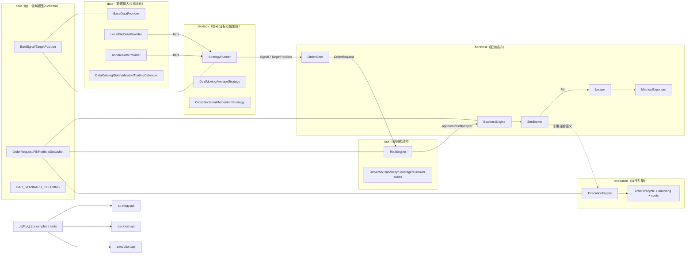

# 项目架构总览（Architecture Overview）

本文基于当前仓库的 `docs + src + tests` 梳理项目整体架构、模块职责与核心调用链。

## 1. 整体架构图



## 2. 模块职责

术语对齐：规则层使用 `pass/modify/reject`；风险引擎对外决策使用 `approve/modify/reject`。

### 2.1 core
- 统一定义跨模块领域对象：`Bar / Signal / TargetPosition / OrderRequest / Fill / PortfolioSnapshot`
- 统一 bars schema 常量与默认语义（如 timeframe/timezone）
- 被 data/strategy/backtest/risk/execution 全部依赖

关键文件：
- `src/quant_system/core/models.py`
- `src/quant_system/core/schema.py`
- `src/quant_system/core/__init__.py`

### 2.2 data
- 定义数据接口 `BaseDataProvider`
- 提供本地数据源 `LocalFileDataProvider` 与在线 A 股数据源 `AshareDataProvider`
- 提供数据目录管理 `DataCatalog`、质量校验 `DataValidator`、交易日历 `TradingCalendar`

关键文件：
- `src/quant_system/data/base.py`
- `src/quant_system/data/local_file_provider.py`
- `src/quant_system/data/ashare_provider.py`
- `src/quant_system/data/catalog.py`
- `src/quant_system/data/validator.py`
- `src/quant_system/data/calendar.py`

### 2.3 strategy
- 策略抽象：`BaseStrategy / SignalStrategy / TargetStrategy`
- 统一运行器：`StrategyRunner`（调仓频率、warmup、缺失数据处理、no-lookahead）
- 内置策略：
  - `DualMovingAverageStrategy`（双均线，输出 Signal）
  - `CrossSectionalMomentumStrategy`（横截面动量，输出 TargetPosition）
- 高层入口：`run_strategy_with_provider`

关键文件：
- `src/quant_system/strategy/base.py`
- `src/quant_system/strategy/runner.py`
- `src/quant_system/strategy/dual_moving_average.py`
- `src/quant_system/strategy/cross_sectional_momentum.py`
- `src/quant_system/strategy/api.py`

### 2.4 backtest
- 系统编排中枢：接策略输出，生成订单、撮合成交、记账、计算绩效
- `OrderSizer`：signals/targets -> orders
- `SimBroker`：撮合逻辑（复用 execution 价格与成本语义）
- `Ledger`：现金/仓位/净值演化
- `metrics/exporters`：指标与导出
- 高层入口：`run_backtest`、`run_backtest_with_provider`

关键文件：
- `src/quant_system/backtest/engine.py`
- `src/quant_system/backtest/order_sizer.py`
- `src/quant_system/backtest/broker.py`
- `src/quant_system/backtest/ledger.py`
- `src/quant_system/backtest/metrics.py`
- `src/quant_system/backtest/api.py`

### 2.5 risk
- 规则引擎 `RiskEngine` 对订单/目标仓位做 `approve/modify/reject`
- 维护审计日志，支持规则链顺序执行
- 内置规则包括 universe、tradability、drawdown、max_symbol_position、max_leverage、daily_turnover

关键文件：
- `src/quant_system/risk/engine.py`
- `src/quant_system/risk/rules.py`
- `src/quant_system/risk/config.py`
- `src/quant_system/risk/models.py`

### 2.6 execution
- 独立执行层 `ExecutionEngine`（订单生命周期、撮合、拒单、挂单管理）
- 支持 `fill_mode`：`next_open` / `current_close`
- 支持不可交易标的策略：`reject` / `keep_pending`
- 对外 API：`create_execution_engine`、`run_execution_step`

关键文件：
- `src/quant_system/execution/engine.py`
- `src/quant_system/execution/config.py`
- `src/quant_system/execution/models.py`
- `src/quant_system/execution/api.py`

## 3. 端到端主链路（backtest 链路）

```text
data provider.load_bars
  -> strategy runner 产出 signals/targets
  -> backtest order_sizer 生成 orders
  -> risk engine 决策（approve/modify/reject）
  -> broker/execution 撮合生成 fills
  -> ledger 更新组合与权益
  -> metrics 生成绩效结果
```

对应高层入口：
- `quant_system.backtest.run_backtest_with_provider(...)`

## 4. 分层依赖关系（简化）

- `core`：底层公共层（全模块依赖）
- `data`：数据输入层（向 strategy/backtest 提供 bars）
- `strategy`：交易意图层（输出 Signal/Target）
- `risk`：风控裁决层（对 Order/Target 做规则决策）
- `execution`：执行撮合层（订单状态与成交）
- `backtest`：回放编排层（串联 strategy/risk/execution 并产出结果）

可抽象为：

```text
core
  ├─ data
  ├─ strategy
  ├─ risk
  ├─ execution
  └─ backtest（编排 strategy + risk + execution）
```
