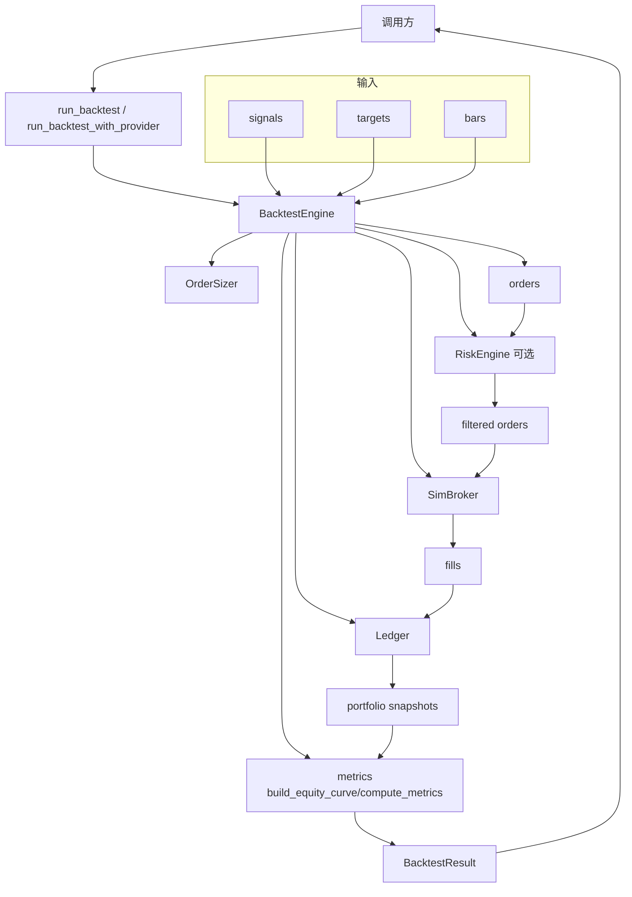
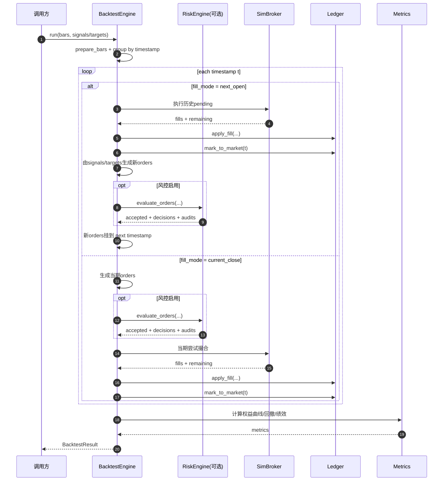

# 回测模块（Backtest Module）

回测模块负责将策略输出（`Signal` / `TargetPosition`）转换为订单、成交、账本与绩效，不承担策略逻辑本身。

## 1. 设计边界

- strategy：产出交易意图（信号/目标仓位）
- backtest：负责订单生成、撮合、资金与持仓演化、绩效计算与导出
- risk / execution：不在 backtest 内硬编码规则与执行实现；通过可选接口接入

## 2. 核心组件

- `BacktestConfig`
  - 初始资金、撮合模式、手续费/滑点、仓位参数、年化参数
- `BacktestEngine`
  - bar-level 事件循环，统一时序推进
- `SimBroker`
  - 支持 `market` / `limit` 撮合
  - 支持 `fill_mode`：`next_open` / `current_close`
- `Ledger`
  - 现金、持仓数量、持仓均价、已实现/未实现盈亏、净值快照
- `compute_metrics`
  - cumulative return、annualized return、annualized volatility、sharpe、max drawdown、win rate、turnover、total trades
- `export_result`
  - 导出 CSV / JSON

## 3. 无未来函数时序

`fill_mode="next_open"` 下每个时间点 `t` 的顺序：

1. 先执行可在 `t` 成交的挂单（来自历史时点）；
2. 再按 `t` 的 close 做组合估值并记录快照；
3. 最后消费策略在 `t` 的输出生成新订单，排队到后续时间点执行。

因此不会出现“同一时点先看未来再成交”的数据泄漏。

## 4. 高层 API

- `run_backtest(strategy, bars, config=None, universe=None, state=None)`
- `run_backtest_with_provider(provider, strategy, symbols, ..., dataset_name=None)`

第二个 API 会先复用数据模块加载 bars，再复用策略模块产出信号/目标，最后进入回测引擎。

## 5. 示例

```bash
python3 examples/run_backtest_demo.py
```

脚本会输出 summary，并在 `data/processed/backtest_outputs/` 下导出结果文件。

## 6. 测试

```bash
pytest tests/backtest -q
```

（如需全量回归可使用 `pytest -q`）

覆盖点包括：

- 账本现金/仓位/盈亏更新
- 手续费/滑点与撮合模式
- `next_open` 时序
- 最大回撤与指标可计算
- API 端到端与导出能力

## 7. 架构图（Mermaid）

### 7.1 组件图



### 7.2 时序图



