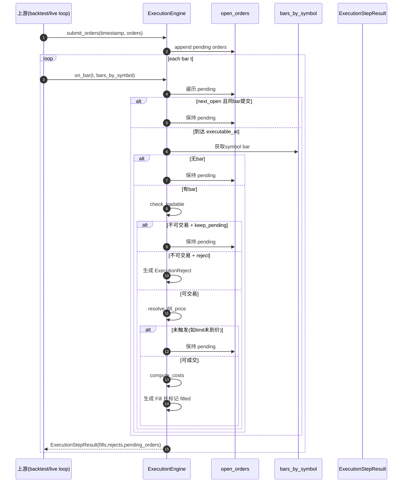

# 执行模块（Execution Module）

执行模块负责在 bar 数据上模拟 paper trading 的订单生命周期，不包含策略逻辑、资金账本和绩效统计。

## 1. 模块边界

- strategy：输出 `Signal` / `TargetPosition`
- backtest.order_sizer：把策略输出转换为 `OrderRequest`
- risk：对订单做 `approve / modify / reject`
- execution：对通过风控的订单做撮合、拒绝与挂单管理
- ledger/performance：处理成交后的持仓与绩效（不在 execution 内）

## 2. 核心对象

- `ExecutionConfig`
  - `fill_mode`: `next_open | current_close`
  - `commission_bps` / `commission_per_order` / `slippage_bps`
  - `untradable_policy`: `reject | keep_pending`
- `ExecutionOrder`
  - 执行层订单状态（`pending/filled/rejected/canceled`）
- `ExecutionReject`
  - 订单拒绝记录（原因、来源、元数据）
- `ExecutionStepResult`
  - 单步执行结果（`fills/rejects/pending_orders`）
- `ExecutionEngine`
  - `submit_orders(...)`
  - `on_bar(...)`
  - `cancel_order(...)`
  - `get_open_orders()`

## 3. 撮合与时序

### `fill_mode="next_open"`

- 时点 `t` 提交订单后，不会在同一 bar 成交；
- 最早在后续 bar 的 open 价格尝试成交；
- 防止同 bar 提交即成交导致的时序泄漏。

### `fill_mode="current_close"`

- 订单可在当前 bar 以 close 价格撮合（market 单）；
- limit 单仍需满足触发条件（buy: `low <= limit`，sell: `high >= limit`）；
- 上述撮合前提均受可交易性检查约束（如停牌/不可交易会进入 reject 或 keep_pending 分支）。

## 4. 不可交易标的处理

执行引擎识别：

- `is_suspended=True`
- 或 `is_tradable=False`

处理策略：

- `untradable_policy="reject"`：生成 `ExecutionReject`
- `untradable_policy="keep_pending"`：继续保留挂单，等待后续 bar

## 5. 与 backtest 的复用关系

`backtest.SimBroker` 已复用 execution 的核心撮合语义：

- `ExecutionEngine.resolve_fill_price(...)`
- `ExecutionEngine.compute_costs(...)`

这样避免了回测与执行层重复维护两套价格/成本逻辑。

## 6. 高层 API

```python
from quant_system.execution import ExecutionConfig, create_execution_engine, run_execution_step

engine = create_execution_engine(ExecutionConfig(fill_mode="next_open"))
orders_or_none = None  # 或传入 OrderRequest 列表
result = run_execution_step(engine, timestamp, bars_by_symbol, orders=orders_or_none)
```

## 7. 示例

```bash
python3 examples/run_execution_demo.py
```

## 8. 测试

```bash
pytest tests/execution -q
```

覆盖点包括：

- market / limit 撮合规则
- `next_open` 与 `current_close` 时序
- 成本模型（commission/slippage）
- 不可交易标的拒绝或挂单策略
- 撤单与 open order 管理

## 9. 架构图（Mermaid）

### 9.1 组件图

```mermaid
flowchart TD
    Up[Risk通过订单] --> EX[ExecutionEngine]
    CFG[ExecutionConfig\nfill_mode/costs/untradable_policy] --> EX
    BAR[bars_by_symbol] --> EX

    EX --> Q[(open_orders pending queue)]
    Q --> MATCH[resolve_fill_price + check_tradable]
    MATCH --> COST[compute_costs]
    COST --> FILLS[Fill[]]
    MATCH --> REJ[ExecutionReject[]]
    Q --> PEND[pending_orders snapshot]

    FILLS --> Down1[ledger/backtest]
    REJ --> Down2[audit/log]
```

### 9.2 时序图



