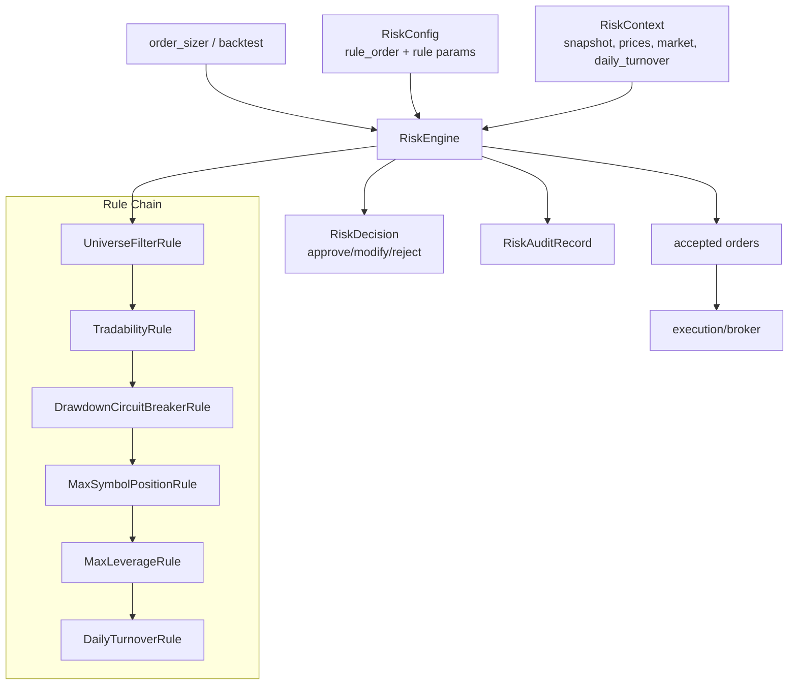

# 风控模块（Risk Module）

风控模块位于 `strategy/backtest` 与执行之间，负责对 `OrderRequest` / `TargetPosition` 做可解释、可审计的风险决策，不在策略层或撮合层散落规则。

## 1. 模块边界

- strategy：产生信号/目标仓位
- backtest.order_sizer：生成订单请求
- risk：对请求执行 `approve / modify / reject`
- broker/ledger：只处理风控通过后的订单

默认链路：

`strategy -> order_sizer -> risk_engine -> broker -> ledger`

## 2. 核心对象

- `RiskConfig`：风控总配置与规则顺序
- `RiskContext`：规则计算上下文（快照、行情、换手）
- `RiskDecision`：单笔请求最终决策
- `RiskAuditRecord`：命中规则审计记录
- `RiskEngine`：规则编排与决策聚合
- `BaseRiskRule`：统一规则基类

## 3. 默认规则与优先级

默认 `rule_order`：

1. `universe_filter`（黑白名单）
2. `tradability`（停牌/不可交易）
3. `drawdown_circuit_breaker`（最大回撤熔断）
4. `max_symbol_position`（单标的仓位上限）
5. `max_leverage`（组合杠杆上限）
6. `daily_turnover`（单日换手上限）

冲突处理：

- `reject` 立即终止后续规则
- `modify` 后继续进入后续规则
- 全部通过为 `approve`

补充说明：`rule_order` 的顺序即规则优先级，前置规则产生的 `modify` 会直接影响后续规则的输入。

## 4. 回测中启用风控

高层 API 可直接传 `risk_config`：

```python
from quant_system.backtest import BacktestConfig, run_backtest_with_provider
from quant_system.risk import RiskConfig

risk_config = RiskConfig()
risk_config.max_symbol_position.max_abs_qty = 100.0
risk_config.max_symbol_position.max_weight = None
risk_config.max_leverage.max_leverage = 0.8
risk_config.daily_turnover.max_ratio_of_equity = 0.5

result = run_backtest_with_provider(
    provider=provider,
    strategy=strategy,
    symbols=["000001.SZ", "000002.SZ"],
    config=BacktestConfig(fill_mode="next_open"),
    dataset_name="sample_multi_csv",
    risk_config=risk_config,
)
```

结果中可直接读取：

- `result.risk_decisions`
- `result.risk_audit_logs`

## 5. 风控决策输出示例

```text
RiskDecision(
  action="modify",
  symbol="000001.SZ",
  rule_name="max_symbol_position",
  reason="clip symbol 000001.SZ position to max_abs_qty=50.000000"
)

RiskAuditRecord(
  action="modify",
  rule_name="max_symbol_position",
  original={...},
  updated={...},
  reason="clip ..."
)
```

## 6. 新增一条规则的方法

1. 继承 `BaseRiskRule`
2. 实现 `evaluate_order`（或 `evaluate_target`）
3. 返回 `RuleResult(action="pass"|"modify"|"reject", ...)`
4. 在 `RiskEngine._build_rules(...)` 注册
5. 在 `RiskConfig.rule_order` 中加入规则名
6. 补充单元测试与示例

示意：

```python
class MyRule(BaseRiskRule):
    def __init__(self) -> None:
        super().__init__(name="my_rule")

    def evaluate_order(self, request, context):
        if ...:
            return RuleResult(action="reject", reason="...")
        return RuleResult(action="pass")
```

## 7. 示例脚本

```bash
python3 examples/run_backtest_with_risk_demo.py
```

脚本会打印：

- 回测 summary
- 每笔风控决策
- 每条审计记录

## 8. 架构图（Mermaid）

### 8.1 组件图



### 8.2 时序图

```mermaid
sequenceDiagram
    autonumber
    participant Caller as Backtest/上游
    participant Engine as RiskEngine
    participant Rule as Rule_i
    participant Out as accepted+decisions+audits

    Caller->>Engine: evaluate_orders(requests, context)

    loop each order
        Engine->>Engine: current = original order
        loop rule_order
            Engine->>Rule: evaluate_order(current, rule_context)
            Rule-->>Engine: RuleResult(pass/modify/reject)

            alt pass
                Engine->>Engine: continue
            else modify
                Engine->>Engine: current = modified_order
                Engine->>Engine: 记录 modify audit
                Engine->>Engine: continue next rule
            else reject
                Engine->>Engine: 记录 reject audit
                Engine->>Engine: 短路终止本单
                break
            end
        end

        alt reject
            Engine->>Engine: 产出 decision=reject
        else approve/modify
            Engine->>Engine: 产出 final_request
            Engine->>Engine: 累计当日turnover
        end
    end

    Engine-->>Caller: accepted, decisions, audits
```

