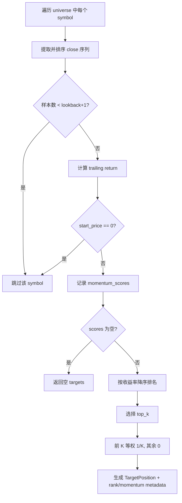

# 横截面动量策略（CrossSectionalMomentumStrategy）

按过去 N 期收益率对标的排名，前 K 名等权配置，其余权重为 0。

## 1. 输入与输出

- 输入：`StrategyContext`（`bars`、`timestamp`、`universe`）
- 输出：`TargetPosition`
  - `target_weight`: 入选标的为等权，未入选为 `0.0`

## 2. 参数说明

| 参数 | 默认值 | 约束 | 含义 |
|---|---:|---|---|
| `lookback_periods` | `5` | `> 0` | 动量回看期数 |
| `top_k` | `3` | `> 0` | 选择前 K 名标的 |

## 3. 决策流程图



## 4. 运行示例

```bash
python3 examples/run_cross_sectional_momentum.py
```

## 5. 输出字段解读

- `metadata.rank`：当前时点横截面排名（1 为最高）
- `metadata.momentum_return`：回看窗口收益率
- `metadata.lookback_periods`：参数快照

## 6. 常见问题

- 没有目标仓位：样本不足 `lookback_periods + 1` 或可用价格为空。
- 目标权重看起来“只持有少数标的”：这是 `top_k` 设计决定。
