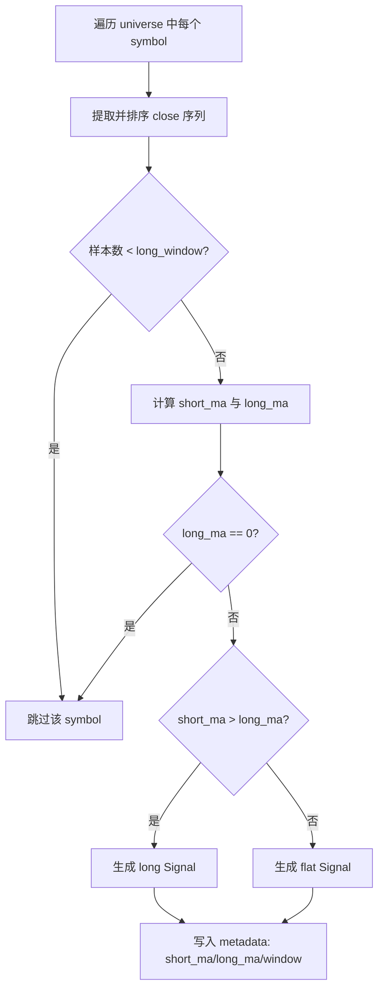

# 双均线策略（DualMovingAverageStrategy）

使用短期均线与长期均线的相对关系，输出 `long/flat` 信号。

## 1. 输入与输出

- 输入：`StrategyContext`（`bars`、`timestamp`、`universe`）
- 输出：`Signal`
  - `direction`: `long` 或 `flat`
  - `strength`: 当 `long` 时为 `(short_ma - long_ma) / abs(long_ma)`，否则 `0.0`

## 2. 参数说明

| 参数 | 默认值 | 约束 | 含义 |
|---|---:|---|---|
| `short_window` | `5` | `> 0` 且 `< long_window` | 短期均线窗口 |
| `long_window` | `20` | `> 0` | 长期均线窗口 |

## 3. 决策流程图



## 4. 运行示例

```bash
python3 examples/run_dual_moving_average.py
```

## 5. 输出字段解读

- `source`：策略来源（来自 `StrategyConfig.source`）
- `metadata.short_window` / `metadata.long_window`：参数快照
- `metadata.short_ma` / `metadata.long_ma`：当前时点均线值

## 6. 常见问题

- 信号数量为 0：通常是样本长度不足 `long_window`。
- 全是 `flat`：短均线未上穿长均线，或数据波动较小。
