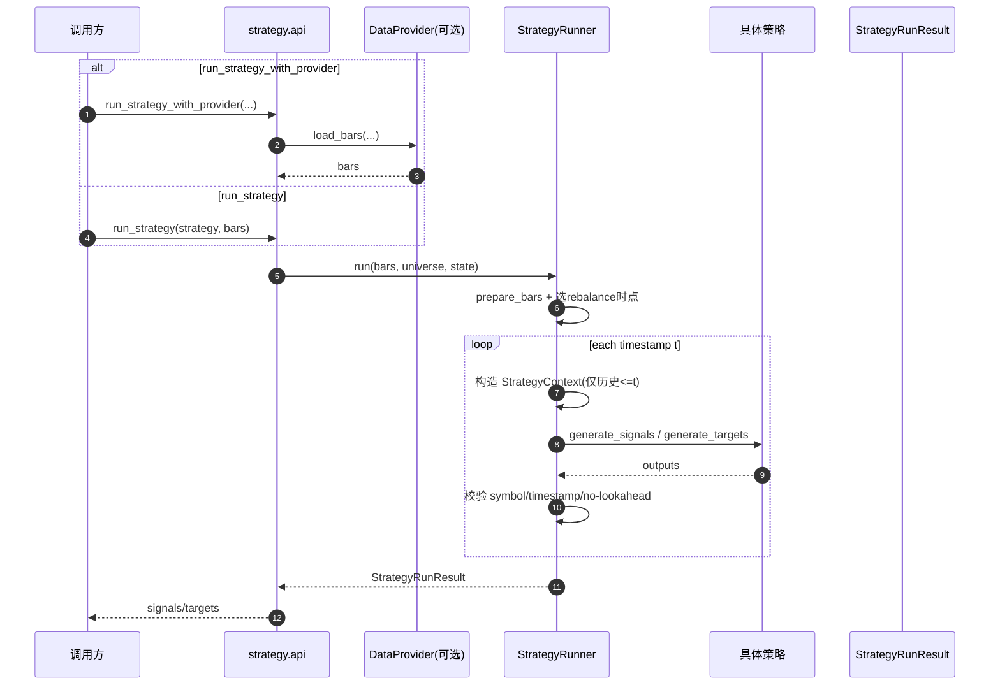

# 策略模块（Strategy Module）

本模块负责“看数据 -> 产出信号/目标仓位”，不包含成交仿真、风控裁剪和资金账本维护。

## 1. 设计概览

核心对象：

- `StrategyConfig`：策略配置（warmup、rebalance、缺失数据策略、参数）
- `StrategyContext`：每个决策时点输入上下文（历史窗口、当前时点、标的池、状态）
- `BaseStrategy`：策略基类
  - `SignalStrategy`：产出 `Signal`
  - `TargetStrategy`：产出 `TargetPosition`
- `StrategyRunner`：统一调度策略运行
- `run_strategy_with_provider`：高层入口（加载数据 + 运行策略）

输出严格使用 `core` 定义的 `Signal` / `TargetPosition`。

## 2. 如何新增一个策略

### 2.1 新增信号策略

继承 `SignalStrategy` 并实现：

```python
def generate_signals(self, context: StrategyContext) -> Sequence[Signal]:
    ...
```

### 2.2 新增目标仓位策略

继承 `TargetStrategy` 并实现：

```python
def generate_targets(self, context: StrategyContext) -> Sequence[TargetPosition]:
    ...
```

### 2.3 接入高层工厂（可选）

在 `strategy/api.py` 的 `_STRATEGY_REGISTRY` 注册新策略类型，支持 `create_strategy` 按名称创建。

## 3. 数据层与策略层衔接

策略可直接消费 data 模块输出的标准 long-format bars：

```python
bars = provider.load_bars(...)
result = StrategyRunner(strategy).run(bars)
```

或使用高层入口：

```python
result = run_strategy_with_provider(
    provider=provider,
    strategy=strategy,
    symbols=["000001.SZ", "000002.SZ", "000003.SZ"],
    start="2024-01-01",
    end="2024-03-01",
    dataset_name="sample_multi_csv",
)
```

## 4. 为什么不会产生未来函数

`StrategyRunner` 在每个 rebalance 时点 `t`：

1. 只切片 `timestamp <= t` 的历史数据给策略；
2. 对输出做时间戳校验，要求输出时间必须等于当前决策时点；
3. 提供单测覆盖 no-lookahead（验证上下文最大时间等于当前时点）。

因此策略逻辑无法访问 `t` 之后的数据。

## 5. 内置样例策略

### 5.1 双均线策略（DualMovingAverageStrategy）

- 参数：`short_window`, `long_window`
- 规则：
  - `short_ma > long_ma` -> `long`
  - 否则 -> `flat`
- 详细文档：`docs/strategies/dual_moving_average/README.md`

### 5.2 横截面动量策略（CrossSectionalMomentumStrategy）

- 参数：`lookback_periods`, `top_k`
- 规则：
  - 按过去 N 期收益率排名
  - 前 K 名等权，其他标的目标权重为 0
- 详细文档：`docs/strategies/cross_sectional_momentum/README.md`

## 6. 示例

```bash
python3 examples/run_dual_moving_average.py
python3 examples/run_cross_sectional_momentum.py
python3 examples/show_strategy_outputs.py
```

## 7. 测试

```bash
pytest -q
```

覆盖点：
- 双均线信号正确性
- warmup 行为
- 缺失数据策略（skip_timestamp / raise）
- 动量排名输出
- daily/weekly rebalance 行为
- no-lookahead

## 8. 架构图（Mermaid）

### 8.1 组件图

```mermaid
flowchart TD
    U[调用方/研究脚本] --> API[run_strategy / run_strategy_with_provider]
    API --> R[StrategyRunner]
    API --> D[BaseDataProvider]

    D --> BARS[标准化 bars DataFrame]
    BARS --> R

    subgraph S[Strategy Layer]
      BS[BaseStrategy]
      SS[SignalStrategy]
      TS[TargetStrategy]
      DMA[DualMovingAverageStrategy]
      CSM[CrossSectionalMomentumStrategy]
    end

    R --> BS
    BS --> SS
    BS --> TS
    SS --> DMA
    TS --> CSM

    R --> Ctx[StrategyContext\n(timestamp,bars,universe,state)]
    R --> OUT[StrategyRunResult\nsignals / targets]

    OUT --> Down[下游(backtest/order_sizer)]
```

### 8.2 时序图



